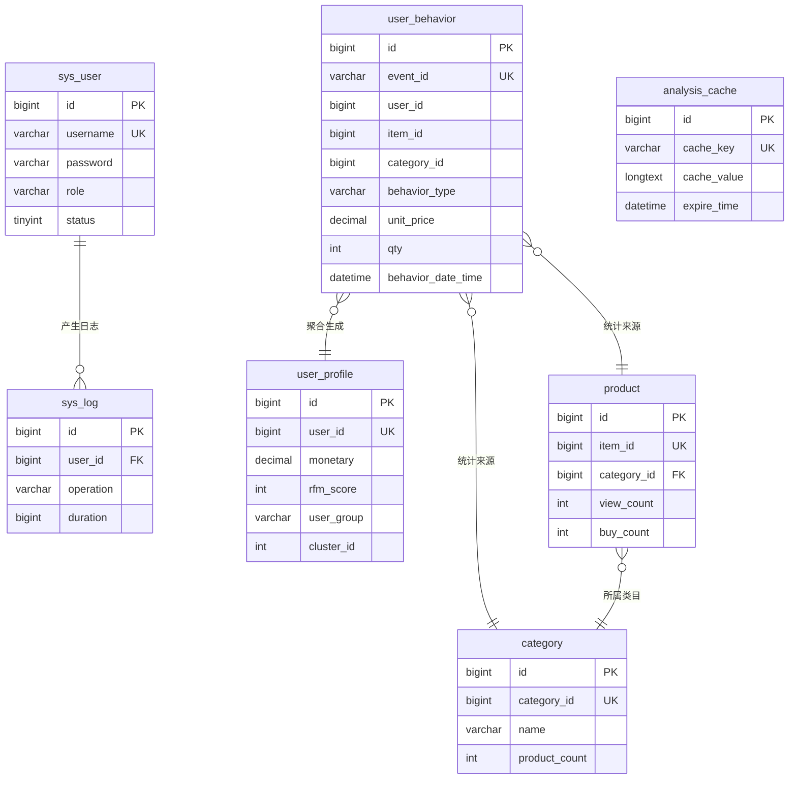
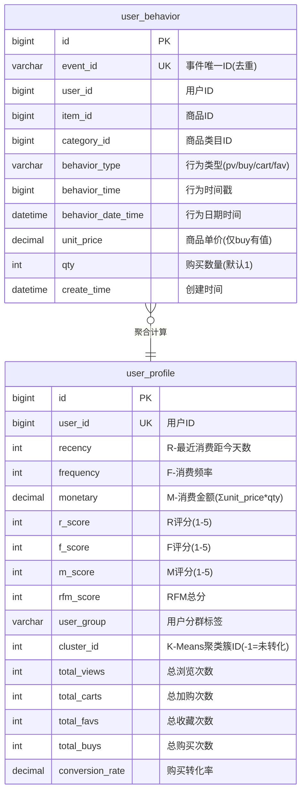
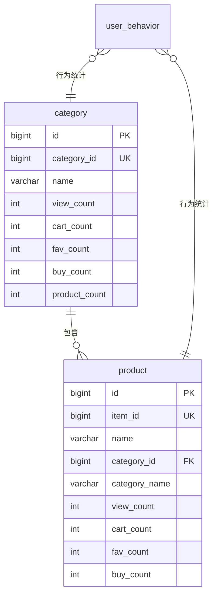
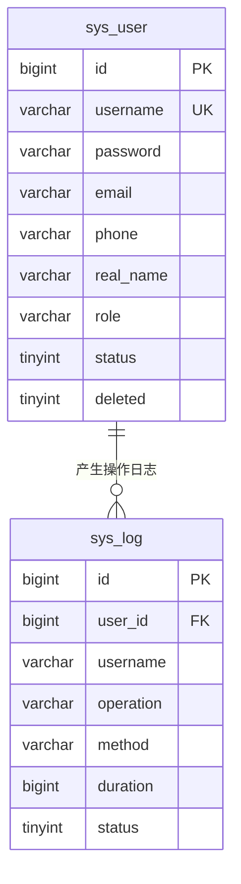

# 电商用户消费行为分析系统 - ER图

本文档包含系统各模块的 ER 图（实体关系图），使用 Mermaid 语法绘制。

---

## 一、系统整体 ER 图



---

## 二、用户行为与画像模块



---

## 三、商品与类目统计模块



---

## 四、系统管理模块



---

## 五、数据表汇总

| 序号 | 表名 | 说明 | 核心字段 |
|:---:|:---|:---|:---|
| 1 | `sys_user` | 系统用户表 | username, password, role |
| 2 | `sys_log` | 系统操作日志表 | user_id, operation, duration |
| 3 | `user_behavior` | 用户行为记录表 | event_id, user_id, item_id, **unit_price**, **qty** |
| 4 | `user_profile` | 用户画像表 | user_id, rfm_score, user_group, cluster_id |
| 5 | `product` | 商品统计表 | item_id, category_id, buy_count |
| 6 | `category` | 类目统计表 | category_id, product_count, buy_count |
| 7 | `analysis_cache` | 分析报表缓存表 | cache_key, cache_value, expire_time |

---

## 六、索引设计

| 表名 | 索引名 | 索引字段 | 说明 |
|:---|:---|:---|:---|
| `user_behavior` | uk_event_id | event_id | 事件去重唯一索引 |
| `user_behavior` | idx_user_id | user_id | 用户维度查询 |
| `user_behavior` | idx_item_id | item_id | 商品维度查询 |
| `user_behavior` | idx_behavior_type | behavior_type | 行为类型过滤 |
| `user_behavior` | idx_user_behavior_composite | user_id, behavior_type, behavior_time | 复合索引（RFM计算） |
| `user_behavior` | idx_type_time_item | behavior_type, behavior_time, item_id | 热门商品/趋势查询 |
| `user_behavior` | idx_type_time_user | behavior_type, behavior_time, user_id | 用户行为时序查询 |
| `user_profile` | idx_user_id | user_id | 用户ID查询 |
| `user_profile` | idx_cluster_id | cluster_id | 聚类分析 |

---

## 七、字段语义说明

### M值（Monetary）计算公式

```
M = Σ(unit_price × qty)  其中 behavior_type = 'buy'
```

| 字段 | 语义 | 来源 | 说明 |
|:---|:---|:---|:---|
| `unit_price` | 商品单价 | 爬虫获取 | 仅购买行为有值，其他为0 |
| `qty` | 购买数量 | 默认1 | 可扩展支持多件购买 |
| `monetary` | 消费金额 | 聚合计算 | = Σ(unit_price × qty) |

> **论文说明建议**：本系统以行为日志与商品价格构造交易金额近似值用于RFM-M；若接入真实订单系统，可直接使用支付成功金额替换，提高精度。
